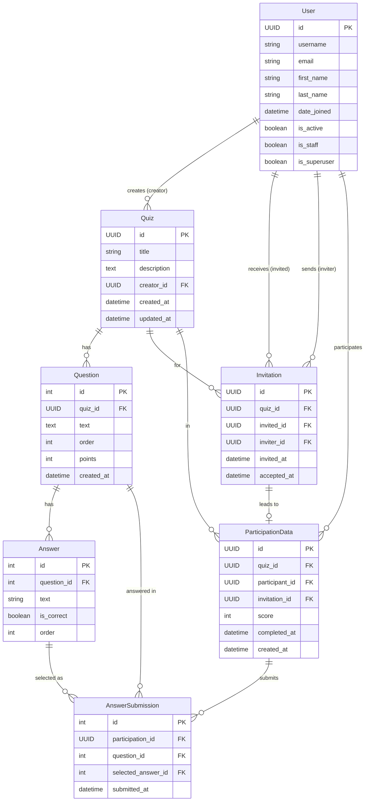

# Quiz-as-a-Service (QaaS) - Backend Engineering Assessment

A Django-based Quiz-as-a-Service platform that allows users to create, manage, and participate in quizzes through a REST API. Built with Clean Architecture principles using Domain-Driven Design (DDD) and CQRS patterns.

## Features

### Quiz Creator Functionality
- ✅ Create quizzes with multiple-choice questions
- ✅ Send quiz invitations via email
- ✅ View quiz scores and participant statistics
- ✅ Monitor quiz progress and completion rates
- ✅ Track invitation acceptance rates
- ✅ Manage created quizzes
- ✅ Asynchronous email delivery with Celery

### Quiz Participant Functionality
- ✅ Accept quiz invitations
- ✅ Participate in invited quizzes
- ✅ Submit quiz answers
- ✅ View personal quiz results and progress
- ✅ Track completion status and scores
- ✅ Access quizzes through invitation links

### Admin Interface
- ✅ Comprehensive Django admin interface
- ✅ Manage all quiz-related data
- ✅ User management and permissions

## Technology Stack

- **Backend**: Django 4.2.22
- **API**: Django REST Framework 
- **Database**: PostgreSQL
- **Authentication**: JWT (djangorestframework-simplejwt 5.3.1)
- **Task Queue**: Celery 5.3.6 with Redis 5.0.1
- **Email**: Django email backend with HTML/text templates
- **Containerization**: Docker & Docker Compose
- **Code Quality**: Black, Flake8
- **Architecture**: Clean Architecture with DDD and CQRS

## Architecture

The project follows **Clean Architecture** principles with:

- **Domain Layer**: Core business logic and entities
- **Application Layer**: Use cases and command/query handlers (CQRS)
- **Infrastructure Layer**: External services, repositories, and views
- **Domain-Driven Design**: Aggregates, repositories, and domain services
- **Dependency Injection**: Factory pattern for loose coupling

### Database Schema (Entity Relationship Diagram)

The following ERD shows the Django models and their relationships:



**Key Relationships:**
- **User** is the central entity that can create quizzes, send/receive invitations, and participate in quizzes
- **Quiz** contains multiple **Questions**, each with multiple **Answers**
- **Invitation** connects users to quizzes (inviter → invited → quiz)
- **ParticipationData** tracks a user's involvement in a quiz (linked to invitation)
- **AnswerSubmission** records each answer a participant submits

**Design Patterns:**
- **UUID primary keys** for most entities (except Question/Answer)
- **Soft relationships** using PROTECT for critical foreign keys
- **Unique constraints** to prevent duplicates
- **Audit fields** with created_at/updated_at timestamps
- **Status tracking** through nullable fields (accepted_at, completed_at)

### Request Flow (Clean Architecture)

The following sequence diagram shows how a request flows through the different architectural layers using the "Create Quiz" operation as an example:

```mermaid
sequenceDiagram
    participant Client as 📱 Client
    participant View as 🌐 Django View
    participant Handler as ⚙️ Command Handler
    participant Factory as 🏭 Factory
    participant Repo as 🗄️ Repository
    participant Domain as 🏛️ Domain Entity
    participant DB as 💾 Database
    
    Client->>View: POST /api/v1/quizzes/
    View->>View: Validate JWT Token
    View->>View: Parse & Validate JSON
    View->>Handler: CreateQuizCommand
    Handler->>Factory: get_quiz_repository()
    Factory-->>Handler: QuizRepository
    Handler->>Handler: Validate Business Rules
    Handler->>Domain: Quiz.create()
    Domain->>Domain: Validate Quiz Data
    Domain-->>Handler: Quiz Entity
    Handler->>Repo: save(quiz)
    Repo->>DB: INSERT INTO quiz...
    DB-->>Repo: Success
    Repo-->>Handler: Saved Quiz
    Handler-->>View: CreateQuizResponse
    View-->>Client: 201 Created + Quiz Data
```



**Key Flow Characteristics:**
- **Infrastructure Layer** (Views) handles HTTP concerns and authentication
- **Application Layer** (Handlers) orchestrates business operations via commands and queries
- **Domain Layer** (Entities) contains core business logic and validation
- **Dependency Injection** through factories maintains loose coupling
- **Clean separation** ensures testability and maintainability

### Domain-Driven Design (DDD) Aggregates

The following diagram shows the DDD aggregate boundaries and their internal structure:

```mermaid
graph TB
    subgraph "Quiz Aggregate"
        QR["🏛️ Quiz<br/>(Aggregate Root)"]
        Q1["📝 Question<br/>(Entity)"]
        A1["✅ Answer<br/>(Entity)"]
        
        QR -->|"contains (1:N)"| Q1
        Q1 -->|"has (1:N)"| A1
    end
    
    subgraph "User Aggregate"
        UR["👤 User<br/>(Aggregate Root)"]
    end
    
    subgraph "Invitation Aggregate"
        IR["📧 Invitation<br/>(Aggregate Root)"]
    end
    
    subgraph "Participation Aggregate"
        PR["🎯 Participation<br/>(Aggregate Root)"]
        AS["📊 AnswerSubmission<br/>(Entity)"]
        
        PR -->|"contains (1:N)"| AS
    end
    
    %% Cross-aggregate references (by ID only)
    QR -.->|"created by"| UR
    IR -.->|"for quiz"| QR
    IR -.->|"invited user"| UR
    IR -.->|"inviter user"| UR
    PR -.->|"quiz reference"| QR
    PR -.->|"participant"| UR
    PR -.->|"via invitation"| IR
    AS -.->|"question reference"| Q1
    AS -.->|"selected answer"| A1
    
    classDef aggregateRoot fill:#ffebee,stroke:#d32f2f,stroke-width:3px
    classDef entity fill:#e8f5e8,stroke:#388e3c,stroke-width:2px
    classDef reference stroke-dasharray: 5 5,stroke:#666
    
    class QR,UR,IR,PR aggregateRoot
    class Q1,A1,AS entity
```



**Aggregate Boundaries & Responsibilities:**

- **🏛️ Quiz Aggregate**: Manages quiz creation, questions, and answers with proper ordering and validation
- **👤 User Aggregate**: Handles user identity, authentication, and profile management  
- **📧 Invitation Aggregate**: Controls invitation lifecycle, acceptance rules, and user permissions
- **🎯 Participation Aggregate**: Manages quiz participation, answer submissions, and scoring

**DDD Design Principles:**
- **Aggregate Roots** (red boxes) are the only entry points to their aggregates
- **Cross-aggregate references** (dotted lines) use IDs only, never direct object references
- **Business invariants** are maintained within each aggregate boundary
- **Consistency** is guaranteed within aggregates, eventual consistency between aggregates

## Getting Started

### Prerequisites
- Docker
- Docker Compose
- Make (for convenience commands)

### Installation & Setup

1. **Clone the repository:**
```bash
git clone <repository-url>
cd qaas
```

2. **Complete setup with one command:**
```bash
# This will set up everything: environment, build, migrate, and create superuser
make setup-env
```

3. **Start the application:**
```bash
# Start all services (Django, PostgreSQL, Redis, Celery)
make run
```

4. **Access the application:**
   - API Base URL: http://localhost:8000/api/v1/
   - Admin Interface: http://localhost:8000/admin/

### Common Development Commands

```bash
# Stop the application
make stop

# Restart the application
make restart

# Access Django shell
make shell

# Run all tests
make test

# Generate new migrations
make generate-migrations

# Apply specific migration
make migrate app=quiz migration=0001

# View all available commands
make help
```

### Redo env and/or reapply database migrations

If you need to totally drop your environment and recreate it from scratch or reapply the DB migrations,
run `make refresh-env`. 

### Code Quality Commands

```bash
# Run all linting checks (flake8 + black)
make lint

# Format code automatically with black
make format

# Run only flake8 linter
make lint-flake8

# Run only black formatter check
make lint-black
```

## Authentication

The API uses **JWT Authentication** with the following endpoints:

| Endpoint | Method | Description |
|----------|--------|-------------|
| `/api/v1/auth/register/` | POST | User registration |
| `/api/v1/auth/login/` | POST | Login and get JWT tokens |
| `/api/v1/auth/refresh/` | POST | Refresh access token |
| `/api/v1/auth/verify/` | POST | Verify token validity |
| `/api/v1/auth/logout/` | POST | Logout and blacklist token |
| `/api/v1/profile/` | GET | Get user profile |

**Token Configuration:**
- Access Token Lifetime: 60 minutes
- Refresh Token Lifetime: 7 days
- Token rotation enabled
- Token blacklisting on logout

For detailed authentication usage, see the [Testing Guide](HOW_TO_TEST.md).

## API Documentation

### API Versioning

The API uses **URL path versioning** for clean and maintainable version management:
- **Current Version**: `v1`
- **Base URL**: `http://localhost:8000/api/v1/`
- **Future Versions**: Easy to add (`v2`, `v3`, etc.) without breaking existing endpoints

### Core API Endpoints (v1)

| Endpoint | Method | Description | Auth Required |
|----------|--------|-------------|---------------|
| `/api/v1/quizzes/` | GET | List user's accessible quizzes | ✅ |
| `/api/v1/quizzes/` | POST | Create a new quiz | ✅ |
| `/api/v1/quizzes/{quiz_id}/` | GET | Get quiz details | ✅ |
| `/api/v1/creators/{creator_id}/quizzes/` | GET | Get creator's quizzes | ✅ |
| `/api/v1/quizzes/{quiz_id}/invitations/` | POST | Send quiz invitation | ✅ |
| `/api/v1/invitations/{invitation_id}/accept/` | POST | Accept invitation | ✅ |
| `/api/v1/quizzes/{quiz_id}/submit/` | POST | Submit quiz answers | ✅ |
| `/api/v1/quizzes/{quiz_id}/progress/` | GET | Get my quiz progress (participant) | ✅ |
| `/api/v1/quizzes/{quiz_id}/scores/` | GET | Get quiz scores (creator only) | ✅ |
| `/api/v1/quizzes/{quiz_id}/creator-progress/` | GET | Get creator quiz progress | ✅ |

For detailed API usage examples, request/response formats, and complete testing workflows, see the [Testing Guide](HOW_TO_TEST.md).

## Testing

The project includes comprehensive tests covering all layers of the Clean Architecture:
- **Domain Layer**: Business logic and rules
- **Application Layer**: Command and query handlers
- **Infrastructure Layer**: Repositories and external services

```bash
# Run all tests
make test
```

For detailed testing instructions, API usage examples, and complete testing workflows, see the [Testing Guide](HOW_TO_TEST.md).

## Development

### Code Quality Tools
- **Black**: Code formatting (line length: 120)
- **Flake8**: Linting and style checking

## Security Features

- **JWT Authentication**: Token-based authentication with rotation
  - Access tokens expire in 60 minutes
  - Refresh tokens expire in 7 days
  - Automatic token rotation and blacklisting
- **Token Blacklisting**: Secure logout functionality with token invalidation
- **Permission Checks**: Proper authorization throughout the application
- **ALLOWED_HOSTS**: Configurable host validation (defaults to "*" in debug mode)
- **UUID Primary Keys**: Non-sequential identifiers for enhanced security
- **Input Validation**: Comprehensive request validation using Voluptuous
- **SQL Injection Protection**: Django ORM built-in protection

## Deployment

### Production Considerations
- Set `DEBUG=False`
- Configure proper `ALLOWED_HOSTS` (remove wildcard "*")
- Use proper secret management (Kubernetes Secrets, HashiCorp Vault, AWS Secrets Manager, etc.)
- Set up health checks and readiness probes
- Use uWSGI as Python web server

## Additional Documentation

- [Testing Guide](HOW_TO_TEST.md) - Comprehensive testing instructions and examples
- [Architecture Documentation](quiz/tests/README.md) - Technical architecture details

## 🚀 Future Improvements

### 🏗️ Architecture & Design Patterns
- **Dependency Injection Container**: Implement proper DI container (e.g., `dependency-injector`)
- **SOLID Principles Refactoring**: Refactor `user` subdomain and admin views applying SOLID principles
- **Criteria Pattern**: Replace multiple `find_by_*` methods with flexible criteria-based queries

### ⚡ Performance & Scalability
- **ASGI with Uvicorn**: Migrate from WSGI to ASGI for async programming and better throughput
- **Database Indexes**: Add strategic indexes for frequent queries (user-quiz, creator-quiz, scores)
- **Pagination**: Add pagination to all read endpoints
- **Materialized Views**: Pre-computed views for complex aggregations
- **Connection Pooling**: Implement persistent database connections
- **CQRS Enhancement**: Separate read/write databases with dedicated read replicas

### 🔄 Event-Driven Architecture
- **Async Event Bus**: Implement domain events with RabbitMQ message broker
- **Enhanced Task Queue**: Replace Redis with RabbitMQ for Celery (better reliability and monitoring)

### 🏢 Infrastructure & Scaling
- **Horizontal Scaling**: Kubernetes deployment with multiple pods and load balancer
- **Auto-scaling (HPA)**: Horizontal Pod Autoscaler based on metrics
- **Database Replicas**: Distribute read load across replicas for resilience and performance

### 🧪 Testing Enhancements
- **Integration Testing**: End-to-end API workflow testing with real database interactions
- **Acceptance Testing**: BDD with Gherkin scenarios for business requirements

### 📊 Monitoring & Observability
- **Sentry**: Real-time error tracking and performance monitoring
- **Datadog**: APM, infrastructure monitoring, and custom business metrics

### 🔒 Security & Operations
- **Secret Management**: Remove `secrets.env` from repository
- **Rate Limiting**: Per-user and IP-based rate limits for security and performance
